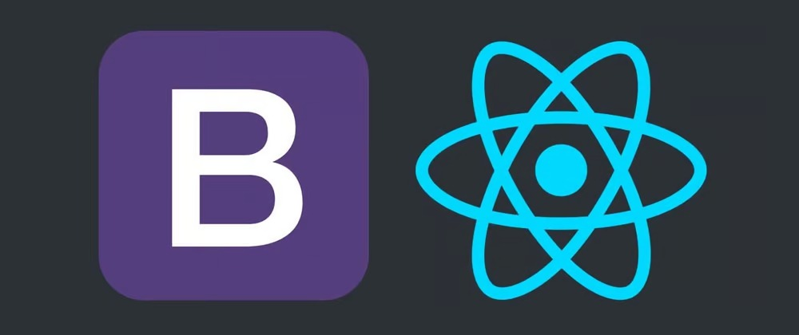

# Toolbox frontend challenge



This repository responds to the Toolbox frontend challenge. The main technologies being used are:

- Vite JS to start the project.
- React JS
- Bootstrap
- Axios
- Jest

### Important

- In order to view the data in the table, you must have the backend running on **port 5000**.

## Installation

To run this project, you will need to execute the following commands:

```bash
npm install
```

## Usage

```python
# run project
npm run dev

# run unit test
npm test
```
